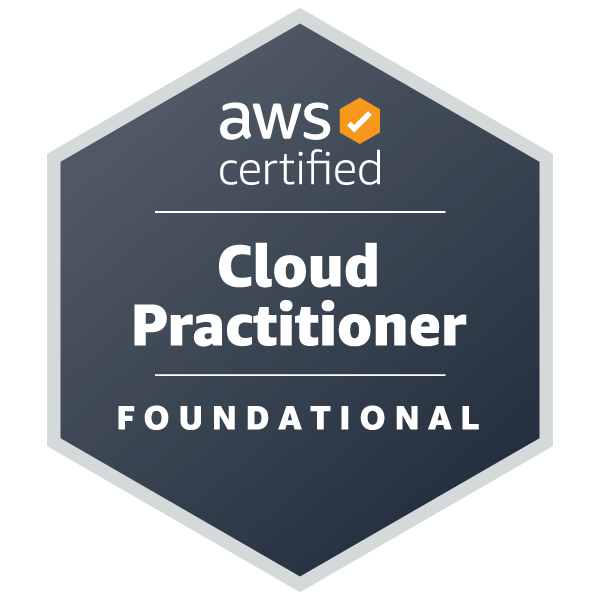

<h1 align="center">Hey, I'm Thomas Basham</h1>

<p align="center">
 
</p>

<p align="center">
  
</p>

---

### About Me

```ts
const thomas = {
  name: "Thomas Basham",
  title: "Cloud Developer & Full Stack Engineer",
  location: "Renton, WA",
  languages: ["Python", "JavaScript", "TypeScript", "SQL", "Bash"],
  frameworks: ["React", "Next.js", "Node.js", "Express", "Django", "FastAPI"],
  cloud: ["AWS", "GCP", "Docker"],
  funFact: "I’ve launched a kayak from more boat ramps than AWS has regions.",
};
```

---

### Current Stack

| **Category**       | **Tech**                                                                    |
| ------------------ | --------------------------------------------------------------------------- |
| **Frontend**       | React, Next.js, TailwindCSS, SWR, Redis                                     |
| **Backend**        | Node.js, Express, FastAPI, Django, Supabase, PostgreSQL                     |
| **Cloud & DevOps** | AWS (Lambda, RDS, API Gateway, IAM, CloudFormation, ECS, EC2), Docker, GitHub Actions |

---

### Projects

- **[Troutlytics](https://github.com/thomas-basham/washington-trout-stats)**  
  Data-driven fishing app with real-time trout stocking insights and analytics.

- **[Collab Done](https://github.com/thomas-basham/collab-done)**  
  Full-stack remote musician collab tool with chat, task boards, and file sharing.

---

### Stats & Activity

<p align="center">
  
  <br />
  
  <br />
  
</p>

---

### What I'm Up To

- Studying for the AWS Solutions Architect Associate
- Building a cloud-native data pipeline with Fargate + Aurora
- Mentoring devs and building clean, testable code
- Saving up for my dream boat

---

### Let's Connect

<p align="left">
  <a href="https://www.linkedin.com/in/thomas-basham" target="_blank">
    
  </a>
  <a href="https://thomasbasham.dev" target="_blank">
    
  </a>
  <a href="mailto:bashamtg@gmail.com">
    
  </a>
</p>

---

### Motto I Code By

> “Build it like someone else has to maintain it.  
> Scale it like a thousand people will use it tomorrow.”

---

### Personal Interests

Fishing Puget Sound  
Kayaking  
Teaching Devs  
Making Music  
Automating All the Things  

---

<p align="center">
  
</p>
